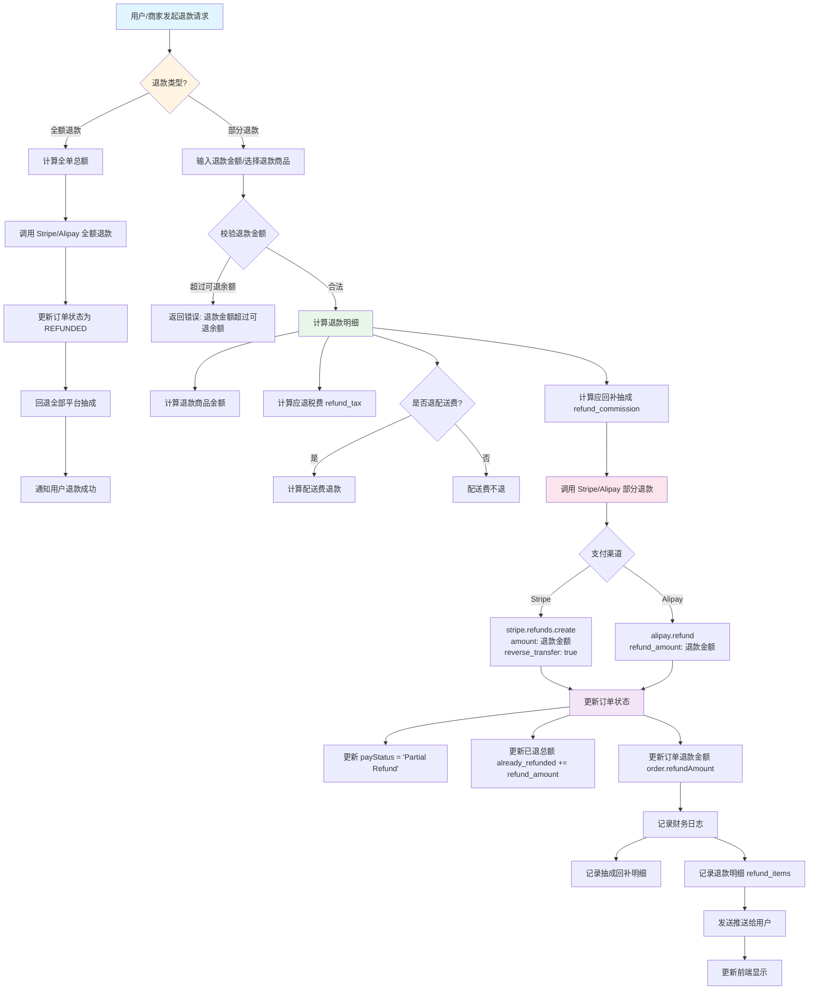

# OO 项目部分退款功能实现指南

## 一、业务流程图



## 二、核心实现逻辑

### 1. 数据结构设计

```typescript
// 退款请求接口
interface RefundRequest {
  orderId: string;                    // 订单ID
  requestNo: string;                  // 退款请求号（幂等性）
  refundType: 'FULL' | 'PARTIAL';     // 退款类型
  refundAmount?: number;              // 退款金额（部分退款时必填）
  refundItems?: RefundItemRequest[];  // 退款商品列表（按商品退款时使用）
  refundDeliveryFee?: boolean;        // 是否退配送费
  refundTips?: boolean;               // 是否退小费
  reason?: string;                     // 退款原因
}

interface RefundItemRequest {
  orderItemId: string;                 // 订单项ID
  refundQuantity: number;               // 退款数量
}

// 退款响应接口
interface RefundResponse {
  refundId: string;                    // 退款单ID
  orderId: string;                     // 订单ID
  refundAmount: number;                 // 退款金额
  status: 'CREATED' | 'PROCESSING' | 'SUCCEEDED' | 'FAILED';
  refundItems: RefundItemResponse[];   // 退款明细
  commissionReversal: number;          // 抽成回补金额
  createdAt: Date;
}

interface RefundItemResponse {
  orderItemId: string;
  itemName: string;
  refundQuantity: number;
  refundAmount: number;
  taxRefund: number;
  discountRefund: number;
}
```

### 2. 抽成计算规则

```typescript
/**
 * 平台抽成计算规则
 */
class CommissionCalculator {
  /**
   * 计算平台抽成
   * @param orderPrice 订单价格信息
   * @param commissionRate 抽成比例（如 0.1 表示 10%）
   * @param fixedFee 固定费用（如 0.30）
   */
  static calculateCommission(orderPrice: OrderPrice, commissionRate: number, fixedFee: number): number {
    // 抽成基数 = 菜品小计 - 折扣金额
    const commissionBase = orderPrice.subtotal - (orderPrice.discount || 0);
    
    // 平台抽成 = 抽成基数 * 抽成比例 + 固定费用
    const commission = commissionBase * commissionRate + fixedFee;
    
    return Math.round(commission * 100) / 100; // 保留2位小数
  }
  
  /**
   * 计算部分退款的抽成回补
   * @param refundAmount 退款金额（菜品部分）
   * @param originalSubtotal 原订单菜品小计
   * @param originalCommission 原订单平台抽成
   */
  static calculateCommissionReversal(
    refundAmount: number, 
    originalSubtotal: number, 
    originalCommission: number
  ): number {
    if (originalSubtotal <= 0) return 0;
    
    // 回补抽成 = (退款金额 / 原菜品总额) * 总抽成
    const reversalRate = refundAmount / originalSubtotal;
    const commissionReversal = originalCommission * reversalRate;
    
    return Math.round(commissionReversal * 100) / 100;
  }
}
```

### 3. 退款服务实现

```typescript
/**
 * 退款服务
 */
class RefundService {
  /**
   * 创建退款
   */
  async createRefund(request: RefundRequest): Promise<RefundResponse> {
    // 1. 幂等性检查
    const existingRefund = await this.findRefundByRequestNo(request.orderId, request.requestNo);
    if (existingRefund) {
      return existingRefund;
    }
    
    // 2. 查询订单（带锁）
    const order = await Order.findById(request.orderId).exec();
    if (!order) {
      throw new Error('订单不存在');
    }
    
    // 3. 检查订单状态
    if (order.orderStatus !== OrderStatus.PAID && order.orderStatus !== OrderStatus.CLOSED) {
      throw new Error('只有已支付或已完成的订单才能申请退款');
    }
    
    // 4. 查询支付记录
    const payment = await Payment.findOne({
      orderId: request.orderId,
      type: PaymentType.CHARGE,
      status: PaymentStatus.SUCCESS
    }).exec();
    
    if (!payment) {
      throw new Error('未找到支付记录');
    }
    
    // 5. 计算退款金额
    let refundAmount: number;
    let refundItems: RefundItemResponse[] = [];
    
    if (request.refundType === 'FULL') {
      // 全额退款
      refundAmount = order.price.total;
    } else {
      // 部分退款
      if (request.refundItems && request.refundItems.length > 0) {
        // 按商品退款
        const calculation = await this.calculateRefundByItems(
          order, 
          request.refundItems, 
          request.refundDeliveryFee,
          request.refundTips
        );
        refundAmount = calculation.totalRefundAmount;
        refundItems = calculation.refundItems;
      } else if (request.refundAmount) {
        // 按金额退款
        refundAmount = request.refundAmount;
        refundItems = await this.calculateRefundByAmount(order, refundAmount);
      } else {
        throw new Error('部分退款必须提供退款金额或退款商品列表');
      }
    }
    
    // 6. 检查可退余额
    const totalRefunded = await this.calculateTotalRefunded(request.orderId);
    const availableRefund = order.price.total - totalRefunded;
    
    if (refundAmount > availableRefund) {
      throw new Error(`退款金额超过可退余额，可退: $${availableRefund}, 请求退款: $${refundAmount}`);
    }
    
    // 7. 计算抽成回补
    const commissionReversal = CommissionCalculator.calculateCommissionReversal(
      refundAmount,
      order.price.subtotal,
      order.price.charge || 0
    );
    
    // 8. 创建退款记录
    const refund = new Refund({
      orderId: request.orderId,
      paymentId: payment._id,
      requestNo: request.requestNo,
      refundAmount: refundAmount,
      refundType: request.refundType,
      reason: request.reason,
      status: RefundStatus.CREATED,
      commissionReversal: commissionReversal,
      createdAt: new Date()
    });
    await refund.save();
    
    // 9. 保存退款明细
    for (const item of refundItems) {
      await RefundItem.create({
        refundId: refund._id,
        orderItemId: item.orderItemId,
        refundQuantity: item.refundQuantity,
        refundAmount: item.refundAmount,
        taxRefund: item.taxRefund,
        discountRefund: item.discountRefund
      });
    }
    
    // 10. 异步处理退款（调用支付渠道）
    this.processRefundAsync(refund, payment, refundAmount);
    
    return this.convertToResponse(refund, refundItems, commissionReversal);
  }
  
  /**
   * 异步处理退款（调用第三方支付平台）
   */
  @Async
  async processRefundAsync(refund: Refund, payment: Payment, refundAmount: number) {
    try {
      // 更新状态为处理中
      refund.status = RefundStatus.PROCESSING;
      await refund.save();
      
      let thirdPartyRefundId: string;
      
      if (payment.paymentService === PaymentServiceEnum.STRIPE) {
        // Stripe 退款
        const stripeRefund = await stripe.refunds.create({
          charge: payment.extra.id,
          amount: Math.round(refundAmount * 100), // 转换为分
          reason: 'requested_by_customer',
          reverse_transfer: true  // 自动回补平台抽成
        });
        thirdPartyRefundId = stripeRefund.id;
        
      } else if (payment.paymentService === PaymentServiceEnum.ALIPAY) {
        // 支付宝退款
        const alipayRefund = await alipayService.refund({
          out_trade_no: payment.thirdPartyTradeNo,
          refund_amount: refundAmount,
          refund_reason: refund.reason
        });
        thirdPartyRefundId = alipayRefund.refund_id;
        
      } else {
        throw new Error(`不支持的支付方式: ${payment.paymentService}`);
      }
      
      // 更新退款状态为成功
      refund.status = RefundStatus.SUCCEEDED;
      refund.thirdPartyRefundId = thirdPartyRefundId;
      await refund.save();
      
      // 更新订单退款金额
      await this.updateOrderRefundAmount(refund.orderId);
      
      // 发送通知给用户
      await this.notifyUser(refund);
      
    } catch (error) {
      // 更新退款状态为失败
      refund.status = RefundStatus.FAILED;
      refund.errorMessage = error.message;
      await refund.save();
      
      throw error;
    }
  }
  
  /**
   * 计算累计已退款金额
   */
  private async calculateTotalRefunded(orderId: string): Promise<number> {
    const refunds = await Refund.find({
      orderId: orderId,
      status: RefundStatus.SUCCEEDED
    }).exec();
    
    return refunds.reduce((sum, refund) => sum + refund.refundAmount, 0);
  }
  
  /**
   * 更新订单退款金额
   */
  private async updateOrderRefundAmount(orderId: string) {
    const totalRefunded = await this.calculateTotalRefunded(orderId);
    const order = await Order.findById(orderId).exec();
    
    order.refundAmount = totalRefunded;
    
    // 如果全额退款，更新订单状态
    if (totalRefunded >= order.price.total) {
      order.orderStatus = OrderStatus.REFUNDED;
    }
    
    await order.save();
  }
}
```

### 4. 修改 checkout.ts 中的 doRefund 方法

```typescript
// checkout.ts

interface DoRefundParam {
  chargePayment: PaymentDocument;
  refundPayment?: PaymentDocument;
  refundAmount?: number;        // 新增：退款金额（部分退款时使用）
  refundItems?: RefundItemRequest[];  // 新增：退款商品列表
  reason?: string;              // 新增：退款原因
}

public static async doRefund({chargePayment, refundPayment, refundAmount, refundItems, reason}: DoRefundParam) {
  // ... 现有代码 ...
  
  if (chargePayment.paymentService === PaymentServiceEnum.STRIPE) {
    // 修改 Stripe 退款逻辑
    const refundOptions: Stripe.RefundCreateOptions = {
      charge: chargePayment.extra.id,
      reason: 'requested_by_customer'
    };
    
    // 如果指定了退款金额，则进行部分退款
    if (refundAmount && refundAmount > 0) {
      refundOptions.amount = Math.round(refundAmount * 100); // 转换为分
      refundOptions.reverse_transfer = true; // 自动回补平台抽成
    }
    // 如果没有指定金额，则全额退款（保持原有逻辑）
    
    const stripeRefund = await stripe.refunds.create(refundOptions);
    
    // 更新退款记录
    // ...
  }
  
  // ... 其他支付渠道类似处理 ...
}
```

### 5. 数据库模型设计

```typescript
// models/refund.ts

const RefundSchema = new Schema({
  orderId: { type: String, required: true, index: true },
  paymentId: { type: Schema.Types.ObjectId, ref: 'Payment', required: true },
  requestNo: { type: String, required: true, unique: true }, // 幂等性保证
  refundType: { type: String, enum: ['FULL', 'PARTIAL'], required: true },
  refundAmount: { type: Number, required: true },
  reason: { type: String },
  status: { 
    type: String, 
    enum: ['CREATED', 'PROCESSING', 'SUCCEEDED', 'FAILED'],
    default: 'CREATED'
  },
  thirdPartyRefundId: { type: String }, // Stripe/Alipay 退款ID
  errorMessage: { type: String },
  commissionReversal: { type: Number, default: 0 }, // 抽成回补金额
  createdAt: { type: Date, default: Date.now },
  updatedAt: { type: Date, default: Date.now }
});

const RefundItemSchema = new Schema({
  refundId: { type: Schema.Types.ObjectId, ref: 'Refund', required: true },
  orderItemId: { type: String, required: true },
  refundQuantity: { type: Number, required: true },
  refundAmount: { type: Number, required: true },
  taxRefund: { type: Number, default: 0 },
  discountRefund: { type: Number, default: 0 },
  createdAt: { type: Date, default: Date.now }
});
```

## 三、前端实现

### 1. 退款页面（refund.html）

```html
<!-- 退款申请表单 -->
<div id="refund-form">
  <h3>申请退款</h3>
  
  <!-- 退款类型选择 -->
  <div>
    <label>
      <input type="radio" name="refundType" value="FULL" checked> 全额退款
    </label>
    <label>
      <input type="radio" name="refundType" value="PARTIAL"> 部分退款
    </label>
  </div>
  
  <!-- 部分退款选项 -->
  <div id="partial-refund-options" style="display: none;">
    <!-- 按商品退款 -->
    <div>
      <h4>选择要退款的商品</h4>
      <table>
        <thead>
          <tr>
            <th><input type="checkbox" id="select-all"> 全选</th>
            <th>商品名称</th>
            <th>数量</th>
            <th>单价</th>
            <th>小计</th>
          </tr>
        </thead>
        <tbody id="order-items-list">
          <!-- 动态生成订单项 -->
        </tbody>
      </table>
    </div>
    
    <!-- 或按金额退款 -->
    <div>
      <h4>或输入退款金额</h4>
      <input type="number" id="refund-amount-input" step="0.01" min="0">
      <span id="available-refund">可退余额: $0.00</span>
    </div>
    
    <!-- 其他选项 -->
    <div>
      <label>
        <input type="checkbox" id="refund-delivery-fee"> 退配送费
      </label>
      <label>
        <input type="checkbox" id="refund-tips"> 退小费
      </label>
    </div>
  </div>
  
  <!-- 退款原因 -->
  <div>
    <label>退款原因</label>
    <textarea id="refund-reason"></textarea>
  </div>
  
  <!-- 提交按钮 -->
  <button id="submit-refund">提交退款申请</button>
</div>

<script>
// 提交退款申请
async function submitRefund() {
  const orderId = getOrderId();
  const refundType = document.querySelector('input[name="refundType"]:checked').value;
  const requestNo = `REFUND_${Date.now()}_${Math.random().toString(36).substr(2, 9)}`;
  
  const request = {
    orderId: orderId,
    requestNo: requestNo,
    refundType: refundType,
    reason: document.getElementById('refund-reason').value
  };
  
  if (refundType === 'PARTIAL') {
    // 按商品退款
    const selectedItems = getSelectedItems();
    if (selectedItems.length > 0) {
      request.refundItems = selectedItems;
    } else {
      // 按金额退款
      const refundAmount = parseFloat(document.getElementById('refund-amount-input').value);
      if (!refundAmount || refundAmount <= 0) {
        alert('请输入有效的退款金额');
        return;
      }
      request.refundAmount = refundAmount;
    }
    
    request.refundDeliveryFee = document.getElementById('refund-delivery-fee').checked;
    request.refundTips = document.getElementById('refund-tips').checked;
  }
  
  try {
    const response = await fetch('/api/refunds', {
      method: 'POST',
      headers: { 'Content-Type': 'application/json' },
      body: JSON.stringify(request)
    });
    
    const result = await response.json();
    if (result.success) {
      alert('退款申请已提交，请等待处理');
      // 轮询退款状态
      pollRefundStatus(result.data.refundId);
    } else {
      alert('退款申请失败: ' + result.message);
    }
  } catch (error) {
    alert('提交退款申请失败: ' + error.message);
  }
}

// 轮询退款状态
async function pollRefundStatus(refundId) {
  const interval = setInterval(async () => {
    const response = await fetch(`/api/refunds/${refundId}`);
    const result = await response.json();
    
    if (result.data.status === 'SUCCEEDED') {
      clearInterval(interval);
      alert('退款成功！退款金额已原路返回');
      updateOrderDisplay();
    } else if (result.data.status === 'FAILED') {
      clearInterval(interval);
      alert('退款失败: ' + result.data.errorMessage);
    }
  }, 3000); // 每3秒查询一次
}
</script>
```

## 四、API 接口设计

```typescript
// controllers/refund.ts

/**
 * 创建退款
 * POST /api/refunds
 */
router.post('/api/refunds', async (req, res) => {
  try {
    const request: RefundRequest = req.body;
    
    // 验证请求
    if (!request.orderId || !request.requestNo) {
      return res.json({ success: false, message: '订单ID和请求号不能为空' });
    }
    
    const refundService = new RefundService();
    const refund = await refundService.createRefund(request);
    
    res.json({ success: true, data: refund });
  } catch (error) {
    res.json({ success: false, message: error.message });
  }
});

/**
 * 查询退款详情
 * GET /api/refunds/:refundId
 */
router.get('/api/refunds/:refundId', async (req, res) => {
  // ...
});

/**
 * 查询订单的退款列表
 * GET /api/refunds/order/:orderId
 */
router.get('/api/refunds/order/:orderId', async (req, res) => {
  // ...
});
```

## 五、Stripe Webhook 处理

```typescript
// controllers/stripe.ts

/**
 * 处理 Stripe 退款 Webhook
 */
router.post('/api/stripe/webhook', async (req, res) => {
  const event = req.body;
  
  if (event.type === 'charge.refunded') {
    const refund = event.data.object;
    const chargeId = refund.charge;
    
    // 查询对应的支付记录
    const payment = await Payment.findOne({ 'extra.id': chargeId }).exec();
    if (!payment) {
      return res.status(404).send('Payment not found');
    }
    
    // 查询退款记录
    const refundRecord = await Refund.findOne({
      paymentId: payment._id,
      thirdPartyRefundId: refund.id
    }).exec();
    
    if (refundRecord) {
      // 更新退款状态
      refundRecord.status = RefundStatus.SUCCEEDED;
      await refundRecord.save();
      
      // 更新订单退款金额
      await refundService.updateOrderRefundAmount(refundRecord.orderId);
    }
  }
  
  res.json({ received: true });
});
```

## 六、实现步骤

1. **数据库迁移**
   - 创建 `refunds` 表
   - 创建 `refund_items` 表
   - 在 `orders` 表中添加 `refundAmount` 字段

2. **后端实现**
   - 实现 `RefundService` 类
   - 实现 `CommissionCalculator` 类
   - 修改 `checkout.ts` 中的 `doRefund` 方法
   - 添加退款 API 接口

3. **前端实现**
   - 创建退款页面
   - 实现退款申请表单
   - 实现退款状态查询和显示

4. **测试**
   - 测试全额退款
   - 测试部分退款（按商品）
   - 测试部分退款（按金额）
   - 测试抽成回补计算
   - 测试并发退款控制

## 七、注意事项

1. **幂等性保证**：使用 `requestNo` 确保同一退款请求只处理一次
2. **并发控制**：使用分布式锁防止同一订单并发退款
3. **金额校验**：确保退款金额不超过可退余额
4. **抽成回补**：Stripe 使用 `reverse_transfer: true` 自动回补平台抽成
5. **状态同步**：通过 Webhook 更新退款状态，确保数据一致性


