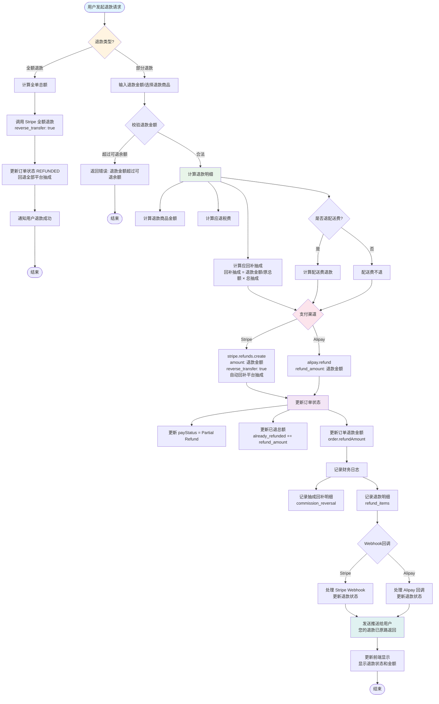

# OO 项目部分退款流程图（简化版）

## 完整业务流程图



## 核心代码修改点

### 1. 修改 checkout.ts 的 doRefund 方法

```typescript
// 添加退款金额参数
interface DoRefundParam {
  chargePayment: PaymentDocument;
  refundPayment?: PaymentDocument;
  refundAmount?: number;  // 新增：部分退款金额
  reason?: string;        // 新增：退款原因
}

// 修改 Stripe 退款调用
const refundOptions: Stripe.RefundCreateOptions = {
  charge: payment.extra.id,
  reason: 'requested_by_customer'
};

if (refundAmount && refundAmount > 0) {
  refundOptions.amount = Math.round(refundAmount * 100); // 转换为分
  refundOptions.reverse_transfer = true; // 自动回补平台抽成
}

return stripe.refunds.create(refundOptions);
```

### 2. 抽成回补计算公式

```typescript
// 回补抽成 = (退款金额 / 原订单总额) × 总平台抽成
const commissionReversal = (refundAmount / originalTotal) * totalCommission;
```

### 3. 数据库字段

```typescript
// orders 表新增字段
refundAmount: number;  // 累计退款金额
refundStatus: string;  // 退款状态: 'NONE' | 'PARTIAL' | 'FULL'

// 新增 refunds 表
{
  orderId: string;
  refundAmount: number;
  refundType: 'FULL' | 'PARTIAL';
  status: 'CREATED' | 'PROCESSING' | 'SUCCEEDED' | 'FAILED';
  commissionReversal: number;  // 抽成回补金额
}
```

## 给 Cursor 的指令模板

```
请帮我实现 OO 项目的部分退款功能，要求：

1. 支持全额退款和部分退款两种类型
2. 部分退款支持按商品退款和按金额退款
3. 计算平台抽成的回补金额：回补抽成 = (退款金额 / 原订单总额) × 总平台抽成
4. Stripe 退款时使用 reverse_transfer: true 自动回补平台抽成
5. 实现幂等性保证（基于 requestNo）
6. 实现并发控制（分布式锁）
7. 通过 Webhook 更新退款状态
8. 更新订单的 refundAmount 字段
9. 如果全额退款，更新订单状态为 REFUNDED

参考文件：OO_REFUND_FLOW.md
```


