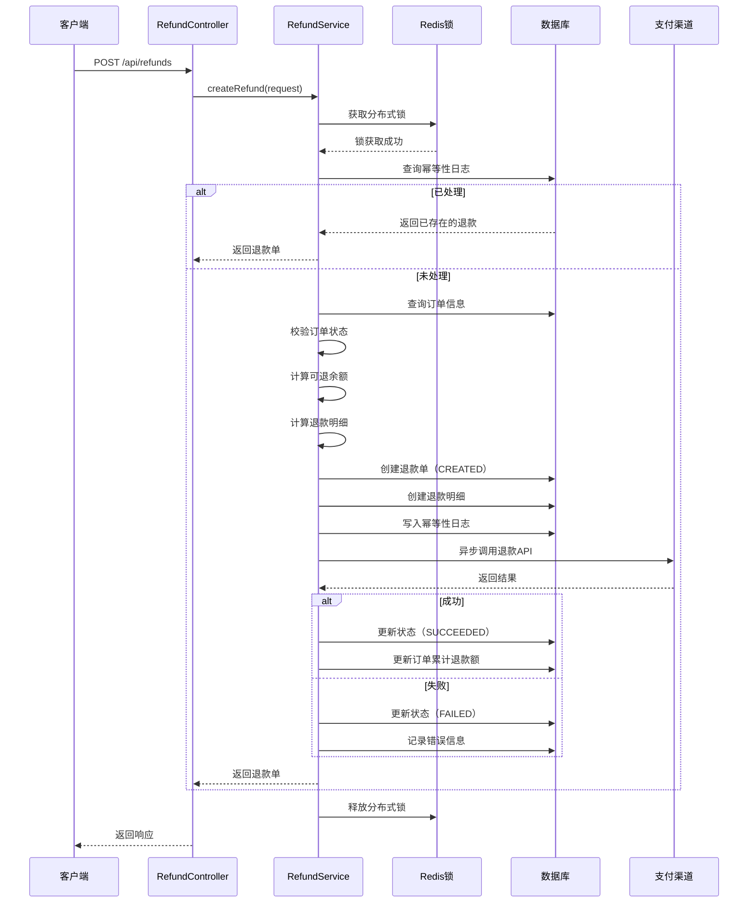

# 退款系统详细设计文档

## 📋 目录

1. [系统概述](#系统概述)
2. [核心特性](#核心特性)
3. [业务流程](#业务流程)
4. [API接口文档](#api接口文档)
5. [数据模型设计](#数据模型设计)
6. [技术实现](#技术实现)
7. [使用示例](#使用示例)
8. [配置部署](#配置部署)
9. [常见问题](#常见问题)
10. [面试要点](#面试要点)

---

## 系统概述

### 1.1 项目背景

本退款系统是为餐饮外卖平台设计的订单退款解决方案，支持在线点餐、自取、配送等多种订单类型的部分或全额退款。

### 1.2 业务目标

- ✅ **灵活退款**：支持按商品、按金额两种退款模式
- ✅ **部分退款**：支持多次部分退款直至全额
- ✅ **精确计算**：自动分配税费、折扣、额外费用
- ✅ **平台抽成**：自动计算并回补平台抽成给商户
- ✅ **高可用性**：分布式锁、幂等性、乐观锁保证数据一致性
- ✅ **第三方集成**：支持Stripe、支付宝等多种支付渠道

### 1.3 技术栈

| 技术 | 版本 | 用途 |
|------|------|------|
| Java | 17+ | 开发语言 |
| Spring Boot | 3.x | 应用框架 |
| MyBatis | 3.5+ | ORM框架 |
| MySQL | 8.0+ | 数据存储（分库分表） |
| Redis | 7.0+ | 分布式锁、缓存 |
| Redisson | 3.x | 分布式锁实现 |
| Stripe Java SDK | 24.x | Stripe支付集成 |
| ShardingSphere | 5.x | 分库分表中间件 |

---

## 核心特性

### 2.1 两种退款模式

#### 模式一：按商品退款（BY_ITEMS）

**适用场景**：
- 商品质量问题（部分商品不合格）
- 商品缺失（订单中部分商品未送达）
- 商品错误（下单时选错，只退部分）

**优势**：
- 精确到商品级别
- 可指定每个商品的退款数量
- 自动按比例分配税费和折扣

**示例**：
```
订单：汉堡5个、薯条2份
退款：汉堡2个（其他保留）
```

#### 模式二：按金额退款（BY_AMOUNT）

**适用场景**：
- 服务补偿（延迟送达、服务态度问题）
- 折扣调整（价格争议协商）
- 灵活退款（不关心具体商品，只退金额）

**优势**：
- 灵活性高
- 适合补偿场景
- 自动按商品比例分配

**示例**：
```
订单总额：$100
补偿退款：$20（不关心具体是哪个商品）
```

---

### 2.2 多次部分退款

**核心机制：可退余额控制**

```
可退余额 = 订单实付金额 - 累计已退款金额

校验规则：
1. 可退余额 > 0 才能发起退款
2. 单次退款金额 <= 可退余额
3. 累计退款 <= 订单实付金额
```

**示例场景**：

```
订单总额：$200
├─ 第1次退款：$50 → 剩余可退 $150
├─ 第2次退款：$30 → 剩余可退 $120
├─ 第3次退款：$120 → 剩余可退 $0（全额退完）
└─ 第4次退款：❌ 拒绝（可退余额为0）
```

---

### 2.3 精确金额计算

#### 税费分配算法

```java
税费退款 = (商品退款金额 / 订单商品小计) × 订单总税费
```

**示例**：
```
订单商品小计：$100
订单总税费：$8（8%税率）
退款商品金额：$30
税费退款：($30 / $100) × $8 = $2.40
```

#### 折扣分配算法

```java
折扣退款 = (商品退款金额 / 订单商品小计) × 订单总折扣
```

**示例**：
```
订单商品小计：$100
订单总折扣：$15
退款商品金额：$30
折扣退款：($30 / $100) × $15 = $4.50
```

#### 最终退款计算

```java
最终退款金额 = 商品退款 + 税费退款 - 折扣退款
              + [配送费退款] + [小费退款] + [服务费退款]
```

**完整示例**：
```
商品退款：$30.00
税费退款：$2.40
折扣退款：-$4.50
配送费退款：$5.00（可选）
小费退款：$3.00（可选）
服务费退款：$2.00（可选）
─────────────────────
最终退款：$37.90
```

---

### 2.4 平台抽成回补

**业务背景**：
- 订单支付时，平台从商户收取抽成（如10%）
- 退款时，需要按比例退还抽成给商户

**计算公式**：

```java
抽成回补金额 = 原订单平台抽成 × (退款金额 / 订单总额)
```

**示例**：
```
订单总额：$200
平台抽成：$20（10%）
退款金额：$50（25%）
抽成回补：$20 × 25% = $5

结算影响：
- 用户退款：$50
- 商户实际减少收入：$50 - $5 = $45
- 平台退还给商户：$5
```

**Stripe集成**：
```java
// Stripe自动处理抽成回补
Map<String, Object> params = new HashMap<>();
params.put("reverse_transfer", true);  // 自动回补
```

---

### 2.5 并发控制和幂等性

#### 三层防护机制

##### 第一层：分布式锁（防止并发退款）

```java
String lockKey = "refund:order:" + orderId;
RLock lock = redissonClient.getLock(lockKey);

if (!lock.tryLock(5, 30, TimeUnit.SECONDS)) {
    throw new RuntimeException("退款处理中，请勿重复提交");
}
```

**作用**：
- 防止同一订单并发发起多个退款
- 保证退款流程的原子性
- 避免可退余额计算错误

##### 第二层：幂等性日志（防止重复提交）

**机制1：请求号（Request Number）**
```java
// 客户端生成唯一请求号
String requestNo = "REF" + System.currentTimeMillis() + UUID.randomUUID();

// 服务端检查
RefundIdempotencyLog log = mapper.selectByRequestNo(orderId, requestNo);
if (log != null && log.getRefundId() != null) {
    return mapper.selectById(log.getRefundId());  // 返回已存在的退款
}
```

**机制2：业务指纹（Fingerprint）**
```java
// 生成业务指纹（防止恶意修改requestNo）
String fingerprint = MD5(requestNo + "|" + orderId + "|" + refundAmount + "|" + timestamp);

// 检查指纹冲突
RefundIdempotencyLog log = mapper.selectByFingerprint(fingerprint);
```

**幂等性日志表结构**：
```sql
CREATE TABLE refund_idempotency_logs (
    id BIGINT PRIMARY KEY,
    order_id BIGINT NOT NULL,
    request_no VARCHAR(100) NOT NULL,
    refund_id BIGINT,
    fingerprint VARCHAR(100),
    request_params JSON,
    result VARCHAR(20),
    UNIQUE KEY uk_request_no (merchant_id, request_no),
    INDEX idx_fingerprint (fingerprint)
);
```

##### 第三层：乐观锁（防止状态并发修改）

```java
// 使用版本号更新
int updated = refundMapper.updateStatusWithVersion(
    refundId,
    currentVersion,
    newStatus
);

if (updated == 0) {
    throw new RuntimeException("退款状态已被其他线程修改");
}
```

**数据库字段**：
```sql
ALTER TABLE refunds_0 ADD COLUMN version BIGINT NOT NULL DEFAULT 1;
```

---

## 业务流程

### 3.1 退款创建流程



---

### 3.2 状态机设计

#### 状态定义

```java
public enum RefundStatus {
    CREATED("CREATED", "已创建"),           // 初始状态
    PROCESSING("PROCESSING", "处理中"),    // 已发送到支付渠道
    SUCCEEDED("SUCCEEDED", "成功"),        // 退款成功（终态）
    FAILED("FAILED", "失败"),              // 退款失败（终态，可重试）
    CANCELED("CANCELED", "已取消")         // 人工取消（终态）
}
```

#### 状态转换规则

```
CREATED
  ├──→ PROCESSING (调用第三方支付API)
  │      ├──→ SUCCEEDED (API返回成功)
  │      └──→ FAILED (API返回失败/超时)
  └──→ CANCELED (人工撤销)

终态：SUCCEEDED, FAILED, CANCELED
```

**状态机代码**：
```java
@Service
public class RefundStateMachine {

    public boolean canTransition(String from, String to) {
        return ALLOWED_TRANSITIONS.getOrDefault(from, Collections.emptySet())
                                   .contains(to);
    }

    private static final Map<String, Set<String>> ALLOWED_TRANSITIONS = Map.of(
        "CREATED", Set.of("PROCESSING", "CANCELED"),
        "PROCESSING", Set.of("SUCCEEDED", "FAILED")
    );
}
```

---

### 3.3 异步处理机制

#### CompletableFuture异步调用

```java
CompletableFuture<RefundResult> future = CompletableFuture.supplyAsync(() -> {
    // 调用第三方支付API
    return paymentAdapter.createRefund(refundRequest);
}, executorService).orTimeout(10, TimeUnit.SECONDS);

future.whenComplete((result, throwable) -> {
    if (throwable != null) {
        // 超时或异常处理
        handleRefundFailure(refund, throwable.getMessage());
    } else if (result.isSuccess()) {
        // 退款成功
        handleRefundSuccess(refund, result);
    } else {
        // 退款失败
        handleRefundFailure(refund, result.getErrorMessage());
    }
});
```

#### 超时降级策略

```java
// 超时时间：10秒
.orTimeout(10, TimeUnit.SECONDS)

// Fallback处理
private void handleFallback(Refund refund, String reason) {
    // 更新状态为PROCESSING（等待异步通知）
    refund.setStatus(RefundStatus.PROCESSING.getCode());
    refund.setErrorMessage("处理超时，等待异步回调: " + reason);
    refundMapper.updateById(refund);

    log.warn("退款API超时，进入Fallback，refundId: {}", refund.getRefundId());
}
```

---

## API接口文档

### 4.1 创建退款

**接口**: `POST /api/refunds`

**请求头**:
```
Content-Type: application/json
Authorization: Bearer {token}
```

**请求体（按商品退款）**:
```json
{
  "orderId": 123456,
  "requestNo": "REF20250202123456001",
  "refundType": "BY_ITEMS",
  "refundItems": [
    {
      "orderItemId": 1,
      "refundQuantity": 2
    },
    {
      "orderItemId": 2,
      "refundQuantity": 1
    }
  ],
  "refundDeliveryFee": false,
  "refundTips": false,
  "refundCharge": false,
  "reason": "商品质量问题"
}
```

**请求体（按金额退款）**:
```json
{
  "orderId": 123456,
  "requestNo": "REF20250202123456002",
  "refundType": "BY_AMOUNT",
  "refundAmount": 50.00,
  "refundDeliveryFee": false,
  "reason": "服务延迟补偿"
}
```

**参数说明**:

| 字段 | 类型 | 必填 | 说明 |
|------|------|------|------|
| orderId | Long | 是 | 订单ID |
| requestNo | String | 是 | 幂等请求号（全局唯一），建议格式：`REF + timestamp + random` |
| refundType | Enum | 是 | 退款类型：`BY_ITEMS`（按商品）或 `BY_AMOUNT`（按金额） |
| refundItems | Array | 条件 | `BY_ITEMS`模式下必填 |
| refundItems[].orderItemId | Long | 是 | 订单项ID |
| refundItems[].refundQuantity | Integer | 是 | 退款数量，必须 > 0 且 <= 订单数量 |
| refundAmount | BigDecimal | 条件 | `BY_AMOUNT`模式下必填，必须 > 0 |
| refundDeliveryFee | Boolean | 否 | 是否退配送费（默认false） |
| refundTips | Boolean | 否 | 是否退小费（默认false） |
| refundCharge | Boolean | 否 | 是否退服务费（默认false） |
| reason | String | 否 | 退款原因（最大500字符） |

**响应成功（200）**:
```json
{
  "success": true,
  "message": "退款创建成功",
  "data": {
    "refundId": 78901,
    "orderId": 123456,
    "requestNo": "REF20250202123456001",
    "refundAmount": 43.20,
    "status": "PROCESSING",
    "reason": "商品质量问题",
    "thirdPartyRefundId": "re_1ABC123XYZ",
    "commissionReversal": 4.32,
    "createdAt": "2025-02-02T10:30:00",
    "processedAt": null,
    "refundItems": [
      {
        "refundItemId": 1001,
        "orderItemId": 1,
        "subject": "ITEM",
        "refundQty": 2,
        "refundAmount": 20.00,
        "taxRefund": 1.60,
        "discountRefund": 2.22
      },
      {
        "refundItemId": 1002,
        "orderItemId": 1,
        "subject": "TAX",
        "refundQty": null,
        "refundAmount": 1.60,
        "taxRefund": 0,
        "discountRefund": 0
      },
      {
        "refundItemId": 1003,
        "orderItemId": 1,
        "subject": "DISCOUNT",
        "refundQty": null,
        "refundAmount": -2.22,
        "taxRefund": 0,
        "discountRefund": 0
      }
    ]
  }
}
```

**响应失败（400/500）**:
```json
{
  "success": false,
  "message": "退款金额超过可退余额，可退: 50.00, 请求: 80.00",
  "errorCode": "REFUND_AMOUNT_EXCEEDED",
  "data": null
}
```

**错误码说明**:

| 错误码 | 说明 | HTTP状态码 |
|--------|------|-----------|
| ORDER_NOT_FOUND | 订单不存在 | 404 |
| ORDER_STATUS_INVALID | 订单状态不允许退款 | 400 |
| REFUND_AMOUNT_EXCEEDED | 退款金额超过可退余额 | 400 |
| REFUND_QTY_EXCEEDED | 退款数量超过订单数量 | 400 |
| DUPLICATE_REQUEST | 重复请求（幂等性拦截） | 200 |
| LOCK_FAILED | 获取分布式锁失败 | 409 |
| PAYMENT_API_ERROR | 第三方支付API错误 | 500 |

---

### 4.2 查询退款详情

**接口**: `GET /api/refunds/{refundId}`

**响应成功**:
```json
{
  "success": true,
  "data": {
    "refundId": 78901,
    "orderId": 123456,
    "requestNo": "REF20250202123456001",
    "refundAmount": 43.20,
    "status": "SUCCEEDED",
    "thirdPartyRefundId": "re_1ABC123XYZ",
    "commissionReversal": 4.32,
    "createdAt": "2025-02-02T10:30:00",
    "processedAt": "2025-02-02T10:30:15",
    "refundItems": [...]
  }
}
```

---

### 4.3 查询订单的所有退款

**接口**: `GET /api/refunds/order/{orderId}`

**响应成功**:
```json
{
  "success": true,
  "data": {
    "orderId": 123456,
    "orderTotalAmount": 200.00,
    "totalRefunded": 93.20,
    "availableRefund": 106.80,
    "refunds": [
      {
        "refundId": 78901,
        "refundAmount": 43.20,
        "status": "SUCCEEDED",
        "createdAt": "2025-02-02T10:30:00"
      },
      {
        "refundId": 78902,
        "refundAmount": 50.00,
        "status": "SUCCEEDED",
        "createdAt": "2025-02-02T11:00:00"
      }
    ]
  }
}
```

---

## 数据模型设计

### 5.1 退款单表（refunds）

**分库分表规则**：基于 `store_id` 哈希，3库 × 3表 = 9张表

```sql
CREATE TABLE IF NOT EXISTS refunds_0 (
    refund_id BIGINT AUTO_INCREMENT PRIMARY KEY COMMENT '退款ID',
    order_id BIGINT NOT NULL COMMENT '订单ID',
    payment_id BIGINT COMMENT '支付记录ID',
    merchant_id VARCHAR(50) NOT NULL COMMENT '商户ID（分片键）',
    store_id BIGINT NOT NULL COMMENT '门店ID（用于分片）',
    shard_id INT NOT NULL COMMENT '分片ID',

    -- 金额相关
    refund_amount DECIMAL(10,2) NOT NULL COMMENT '退款总金额',
    commission_reversal DECIMAL(10,2) COMMENT '抽成回补金额',

    -- 退款信息
    request_no VARCHAR(100) NOT NULL COMMENT '幂等请求号',
    refund_type VARCHAR(20) NOT NULL COMMENT '退款类型：BY_ITEMS/BY_AMOUNT',
    reason VARCHAR(500) COMMENT '退款原因',

    -- 状态管理
    status VARCHAR(20) NOT NULL DEFAULT 'CREATED' COMMENT '状态：CREATED/PROCESSING/SUCCEEDED/FAILED/CANCELED',
    third_party_refund_id VARCHAR(100) COMMENT '第三方退款ID（Stripe/支付宝）',
    error_message TEXT COMMENT '错误信息',

    -- 并发控制
    version BIGINT NOT NULL DEFAULT 1 COMMENT '乐观锁版本号',

    -- 时间戳
    created_at DATETIME NOT NULL DEFAULT CURRENT_TIMESTAMP COMMENT '创建时间',
    updated_at DATETIME ON UPDATE CURRENT_TIMESTAMP COMMENT '更新时间',
    processed_at DATETIME COMMENT '处理完成时间',

    -- 索引
    UNIQUE KEY uk_request_no (merchant_id, request_no) COMMENT '幂等性约束',
    INDEX idx_order_id (order_id) COMMENT '订单查询索引',
    INDEX idx_status (status) COMMENT '状态查询索引',
    INDEX idx_created_at (created_at) COMMENT '时间范围查询索引',
    INDEX idx_third_party_id (third_party_refund_id) COMMENT '第三方退款ID索引'
) ENGINE=InnoDB DEFAULT CHARSET=utf8mb4 COMMENT='退款单表';
```

**字段说明**：

| 字段 | 类型 | 说明 | 示例 |
|------|------|------|------|
| refund_id | BIGINT | 退款ID（主键） | 78901 |
| order_id | BIGINT | 关联订单ID | 123456 |
| refund_amount | DECIMAL(10,2) | 退款总金额 | 43.20 |
| commission_reversal | DECIMAL(10,2) | 平台抽成回补金额 | 4.32 |
| request_no | VARCHAR(100) | 幂等请求号 | REF20250202001 |
| status | VARCHAR(20) | 退款状态 | SUCCEEDED |
| version | BIGINT | 乐观锁版本号 | 3 |

---

### 5.2 退款明细表（refund_items）

```sql
CREATE TABLE IF NOT EXISTS refund_items_0 (
    refund_item_id BIGINT AUTO_INCREMENT PRIMARY KEY COMMENT '明细ID',
    refund_id BIGINT NOT NULL COMMENT '退款ID',
    merchant_id VARCHAR(50) NOT NULL COMMENT '商户ID（分片键）',
    store_id BIGINT NOT NULL COMMENT '门店ID（用于分片）',
    shard_id INT NOT NULL COMMENT '分片ID',

    -- 关联信息
    order_item_id BIGINT COMMENT '订单项ID',
    subject VARCHAR(50) NOT NULL COMMENT '科目：ITEM/TAX/DELIVERY_FEE/TIPS/CHARGE/DISCOUNT',

    -- 金额明细
    refund_qty INT COMMENT '退款数量（按商品退款时）',
    refund_amount DECIMAL(10,2) NOT NULL COMMENT '该科目的退款金额',
    tax_refund DECIMAL(10,2) DEFAULT 0 COMMENT '税费退款（仅ITEM科目）',
    discount_refund DECIMAL(10,2) DEFAULT 0 COMMENT '折扣退款（仅ITEM科目）',

    -- 时间戳
    created_at DATETIME NOT NULL DEFAULT CURRENT_TIMESTAMP COMMENT '创建时间',

    -- 索引
    INDEX idx_refund_id (refund_id) COMMENT '退款单查询索引',
    INDEX idx_order_item_id (order_item_id) COMMENT '订单项查询索引'
) ENGINE=InnoDB DEFAULT CHARSET=utf8mb4 COMMENT='退款明细表';
```

**科目（Subject）说明**：

| 科目 | 说明 | 示例金额 |
|------|------|---------|
| ITEM | 商品退款 | $20.00 |
| TAX | 税费退款 | $1.60 |
| DELIVERY_FEE | 配送费退款 | $5.00 |
| TIPS | 小费退款 | $3.00 |
| CHARGE | 服务费退款 | $2.00 |
| DISCOUNT | 折扣退款（负数） | -$2.22 |

---

### 5.3 幂等性日志表（refund_idempotency_logs）

```sql
CREATE TABLE refund_idempotency_logs (
    id BIGINT AUTO_INCREMENT PRIMARY KEY COMMENT '日志ID',
    order_id BIGINT NOT NULL COMMENT '订单ID',
    request_no VARCHAR(100) NOT NULL COMMENT '幂等请求号',
    refund_id BIGINT COMMENT '退款ID（处理后回填）',
    merchant_id VARCHAR(50) COMMENT '商户ID',

    -- 幂等性控制
    fingerprint VARCHAR(100) COMMENT '业务指纹（MD5）',
    request_params JSON COMMENT '请求参数（用于调试）',

    -- 处理结果
    result VARCHAR(20) COMMENT '处理结果：SUCCESS/FAILED',
    error_message TEXT COMMENT '错误信息',

    -- 时间戳
    created_at DATETIME NOT NULL DEFAULT CURRENT_TIMESTAMP COMMENT '创建时间',
    updated_at DATETIME ON UPDATE CURRENT_TIMESTAMP COMMENT '更新时间',

    -- 索引
    UNIQUE KEY uk_request_no (merchant_id, request_no) COMMENT '请求号唯一约束',
    INDEX idx_fingerprint (fingerprint) COMMENT '指纹查询索引',
    INDEX idx_refund_id (refund_id) COMMENT '退款ID索引'
) ENGINE=InnoDB DEFAULT CHARSET=utf8mb4 COMMENT='退款幂等性日志表';
```

---

### 5.4 实体类（Entity）

#### Refund.java

```java
@Data
@TableName("refunds")
public class Refund {
    @TableId(type = IdType.AUTO)
    private Long refundId;

    private Long orderId;
    private Long paymentId;
    private String merchantId;
    private Long storeId;
    private Integer shardId;

    private BigDecimal refundAmount;
    private BigDecimal commissionReversal;

    private String requestNo;
    private String refundType;
    private String reason;

    private String status;
    private String thirdPartyRefundId;
    private String errorMessage;

    @Version
    private Long version;

    private LocalDateTime createdAt;
    private LocalDateTime updatedAt;
    private LocalDateTime processedAt;
}
```

#### RefundItem.java

```java
@Data
@TableName("refund_items")
public class RefundItem {
    @TableId(type = IdType.AUTO)
    private Long refundItemId;

    private Long refundId;
    private String merchantId;
    private Long storeId;
    private Integer shardId;

    private Long orderItemId;
    private String subject;

    private Integer refundQty;
    private BigDecimal refundAmount;
    private BigDecimal taxRefund;
    private BigDecimal discountRefund;

    private LocalDateTime createdAt;
}
```

---

## 技术实现

### 6.1 核心Service类

#### RefundService.java（核心业务逻辑）

```java
@Service
@Slf4j
@RequiredArgsConstructor
public class RefundService {

    private final RefundMapper refundMapper;
    private final RefundItemMapper refundItemMapper;
    private final OrderMapper orderMapper;
    private final PaymentMapper paymentMapper;
    private final RefundIdempotencyLogMapper idempotencyLogMapper;
    private final RefundCalculator refundCalculator;
    private final PaymentAdapterFactory paymentAdapterFactory;
    private final RedissonClient redissonClient;

    /**
     * 创建退款（主入口）
     */
    @Transactional(rollbackFor = Exception.class)
    public RefundResponse createRefund(RefundRequest request) {
        // 1. 参数校验
        validateRequest(request);

        // 2. 获取分布式锁
        String lockKey = "refund:order:" + request.getOrderId();
        RLock lock = redissonClient.getLock(lockKey);

        try {
            if (!lock.tryLock(5, 30, TimeUnit.SECONDS)) {
                throw new RuntimeException("退款处理中，请勿重复提交");
            }

            // 3. 幂等性检查
            RefundIdempotencyLog existingLog = checkIdempotency(request);
            if (existingLog != null && existingLog.getRefundId() != null) {
                log.info("幂等性拦截：返回已存在的退款，requestNo={}", request.getRequestNo());
                Refund existingRefund = refundMapper.selectById(existingLog.getRefundId());
                return buildResponse(existingRefund);
            }

            // 4. 查询订单信息（加锁）
            Order order = orderMapper.selectByIdForUpdate(request.getOrderId());
            if (order == null) {
                throw new RuntimeException("订单不存在");
            }

            // 5. 校验订单状态
            validateOrderStatus(order);

            // 6. 查询支付记录
            Payment payment = paymentMapper.selectByOrderId(request.getOrderId());
            if (payment == null) {
                throw new RuntimeException("支付记录不存在");
            }

            // 7. 计算可退余额
            BigDecimal totalRefunded = calculateTotalRefunded(request.getOrderId());
            BigDecimal totalPaid = parseOrderPrice(order);
            BigDecimal availableRefund = totalPaid.subtract(totalRefunded);

            if (availableRefund.compareTo(BigDecimal.ZERO) <= 0) {
                throw new RuntimeException("订单已全额退款，无法继续退款");
            }

            // 8. 计算退款明细
            RefundCalculationResult calculation = refundCalculator.calculate(request, order);

            // 9. 校验退款金额
            if (calculation.getTotalRefundAmount().compareTo(availableRefund) > 0) {
                throw new RuntimeException(
                    String.format("退款金额超过可退余额，可退: %.2f, 请求: %.2f",
                        availableRefund, calculation.getTotalRefundAmount())
                );
            }

            // 10. 计算抽成回补
            BigDecimal commissionReversal = calculateCommissionReversal(
                order, calculation.getTotalRefundAmount()
            );

            // 11. 创建退款单
            Refund refund = buildRefund(request, order, calculation, commissionReversal);
            refundMapper.insert(refund);

            // 12. 创建退款明细
            List<RefundItem> items = buildRefundItems(refund.getRefundId(), calculation);
            items.forEach(refundItemMapper::insert);

            // 13. 写入幂等性日志
            saveIdempotencyLog(request, refund.getRefundId(), "SUCCESS");

            // 14. 异步调用第三方支付API
            processRefundAsync(refund, payment);

            return buildResponse(refund, items);

        } catch (InterruptedException e) {
            Thread.currentThread().interrupt();
            throw new RuntimeException("获取锁被中断", e);
        } finally {
            if (lock.isHeldByCurrentThread()) {
                lock.unlock();
            }
        }
    }

    /**
     * 异步调用第三方支付API
     */
    private void processRefundAsync(Refund refund, Payment payment) {
        PaymentAdapter adapter = paymentAdapterFactory.getAdapter(payment.getPaymentService());

        PaymentAdapter.RefundRequest apiRequest = PaymentAdapter.RefundRequest.builder()
            .paymentService(payment.getPaymentService())
            .paymentIntentId(payment.getThirdPartyPaymentId())
            .refundAmount(refund.getRefundAmount())
            .reason(refund.getReason())
            .requestNo(refund.getRequestNo())
            .build();

        CompletableFuture<PaymentAdapter.RefundResult> future =
            CompletableFuture.supplyAsync(() -> adapter.createRefund(apiRequest))
                             .orTimeout(10, TimeUnit.SECONDS);

        future.whenComplete((result, throwable) -> {
            if (throwable != null) {
                handleRefundFailure(refund, throwable.getMessage());
            } else if (result.isSuccess()) {
                handleRefundSuccess(refund, result);
            } else {
                handleRefundFailure(refund, result.getErrorMessage());
            }
        });
    }

    /**
     * 处理退款成功
     */
    private void handleRefundSuccess(Refund refund, PaymentAdapter.RefundResult result) {
        refund.setStatus(RefundStatus.SUCCEEDED.getCode());
        refund.setThirdPartyRefundId(result.getThirdPartyRefundId());
        refund.setProcessedAt(LocalDateTime.now());

        int updated = refundMapper.updateStatusWithVersion(
            refund.getRefundId(),
            refund.getVersion(),
            refund.getStatus(),
            result.getThirdPartyRefundId()
        );

        if (updated > 0) {
            // 更新订单的累计退款金额
            orderMapper.incrementTotalRefunded(refund.getOrderId(), refund.getRefundAmount());
            log.info("退款成功：refundId={}, amount={}", refund.getRefundId(), refund.getRefundAmount());
        }
    }
}
```

---

#### RefundCalculator.java（退款金额计算器）

```java
@Service
@Slf4j
@RequiredArgsConstructor
public class RefundCalculator {

    private final OrderItemMapper orderItemMapper;

    /**
     * 计算退款明细（主入口）
     */
    public RefundCalculationResult calculate(RefundRequest request, Order order) {
        if (RefundType.BY_ITEMS.name().equals(request.getRefundType())) {
            return calculateByItems(request, order);
        } else if (RefundType.BY_AMOUNT.name().equals(request.getRefundType())) {
            return calculateByAmount(request, order);
        } else {
            throw new RuntimeException("不支持的退款类型: " + request.getRefundType());
        }
    }

    /**
     * 按商品计算退款
     */
    private RefundCalculationResult calculateByItems(RefundRequest request, Order order) {
        RefundCalculationResult result = new RefundCalculationResult();

        // 获取订单价格信息
        BigDecimal orderSubtotal = parseOrderSubtotal(order);
        BigDecimal orderTaxTotal = parseOrderTaxTotal(order);
        BigDecimal orderDiscount = parseOrderDiscount(order);

        BigDecimal totalRefund = BigDecimal.ZERO;
        List<RefundItemCalculation> itemCalculations = new ArrayList<>();

        // 遍历每个退款商品
        for (RefundItemRequest itemRequest : request.getRefundItems()) {
            // 查询订单项
            OrderItem orderItem = orderItemMapper.selectById(itemRequest.getOrderItemId());
            if (orderItem == null) {
                throw new RuntimeException("订单项不存在: " + itemRequest.getOrderItemId());
            }

            // 校验退款数量
            if (itemRequest.getRefundQuantity() > orderItem.getQuantity()) {
                throw new RuntimeException(
                    String.format("退款数量(%d)超过订单数量(%d)",
                        itemRequest.getRefundQuantity(), orderItem.getQuantity())
                );
            }

            // 计算商品退款
            ItemRefundAmount itemRefund = calculateItemRefund(
                orderItem,
                itemRequest.getRefundQuantity(),
                orderSubtotal,
                orderTaxTotal,
                orderDiscount
            );

            totalRefund = totalRefund.add(itemRefund.getTotalRefund());
            itemCalculations.add(itemRefund.toCalculation());
        }

        // 处理额外费用
        if (Boolean.TRUE.equals(request.getRefundDeliveryFee())) {
            BigDecimal deliveryFee = parseDeliveryFee(order);
            totalRefund = totalRefund.add(deliveryFee);
            itemCalculations.add(buildExtraFeeCalculation("DELIVERY_FEE", deliveryFee));
        }

        if (Boolean.TRUE.equals(request.getRefundTips())) {
            BigDecimal tips = parseTips(order);
            totalRefund = totalRefund.add(tips);
            itemCalculations.add(buildExtraFeeCalculation("TIPS", tips));
        }

        if (Boolean.TRUE.equals(request.getRefundCharge())) {
            BigDecimal charge = parseCharge(order);
            totalRefund = totalRefund.add(charge);
            itemCalculations.add(buildExtraFeeCalculation("CHARGE", charge));
        }

        result.setTotalRefundAmount(totalRefund);
        result.setItemCalculations(itemCalculations);
        return result;
    }

    /**
     * 计算单个商品的退款
     */
    private ItemRefundAmount calculateItemRefund(
            OrderItem orderItem,
            Integer refundQty,
            BigDecimal orderSubtotal,
            BigDecimal orderTaxTotal,
            BigDecimal orderDiscount) {

        // 1. 计算商品单价
        BigDecimal itemUnitPrice = orderItem.getItemPriceTotal()
            .divide(BigDecimal.valueOf(orderItem.getQuantity()), 2, RoundingMode.HALF_UP);

        // 2. 计算商品退款金额
        BigDecimal itemRefundAmount = itemUnitPrice.multiply(BigDecimal.valueOf(refundQty));

        // 3. 按比例分配税费
        BigDecimal taxRefund = itemRefundAmount
            .divide(orderSubtotal, 4, RoundingMode.HALF_UP)
            .multiply(orderTaxTotal)
            .setScale(2, RoundingMode.HALF_UP);

        // 4. 按比例分配折扣
        BigDecimal discountRefund = itemRefundAmount
            .divide(orderSubtotal, 4, RoundingMode.HALF_UP)
            .multiply(orderDiscount)
            .setScale(2, RoundingMode.HALF_UP);

        // 5. 计算总退款
        BigDecimal totalRefund = itemRefundAmount.add(taxRefund).subtract(discountRefund);

        return ItemRefundAmount.builder()
            .orderItemId(orderItem.getId())
            .refundQty(refundQty)
            .itemRefundAmount(itemRefundAmount)
            .taxRefund(taxRefund)
            .discountRefund(discountRefund)
            .totalRefund(totalRefund)
            .build();
    }
}
```

---

### 6.2 第三方支付适配器

#### PaymentAdapter接口

```java
public interface PaymentAdapter {

    /**
     * 创建退款
     */
    RefundResult createRefund(RefundRequest request);

    /**
     * 查询退款状态
     */
    RefundStatusResult queryRefundStatus(String thirdPartyRefundId);

    @Data
    @Builder
    class RefundRequest {
        private PaymentServiceEnum paymentService;
        private String paymentIntentId;        // Stripe Payment Intent ID
        private String thirdPartyTradeNo;      // 支付宝交易号
        private BigDecimal refundAmount;       // 退款金额
        private String reason;                 // 退款原因
        private String requestNo;              // 幂等键
    }

    @Data
    class RefundResult {
        private boolean success;
        private String thirdPartyRefundId;     // 第三方退款ID
        private RefundStatus status;           // 退款状态
        private String errorMessage;
    }

    enum RefundStatus {
        PENDING, PROCESSING, SUCCEEDED, FAILED
    }
}
```

---

#### StripePaymentAdapter实现

```java
@Service
@Slf4j
public class StripePaymentAdapter implements PaymentAdapter {

    @Value("${stripe.api.key}")
    private String stripeApiKey;

    @PostConstruct
    public void init() {
        Stripe.apiKey = stripeApiKey;
    }

    @Override
    public RefundResult createRefund(RefundRequest request) {
        try {
            // 金额转换（Stripe使用分为单位）
            long amountInCents = request.getRefundAmount()
                .multiply(BigDecimal.valueOf(100))
                .longValue();

            // 构建退款参数
            Map<String, Object> params = new HashMap<>();
            params.put("payment_intent", request.getPaymentIntentId());
            params.put("amount", amountInCents);
            params.put("reason", "requested_by_customer");
            params.put("reverse_transfer", true);  // 自动回补抽成

            // 幂等性键
            RequestOptions requestOptions = RequestOptions.builder()
                .setIdempotencyKey(request.getRequestNo())
                .build();

            // 调用Stripe API
            Refund stripeRefund = Refund.create(params, requestOptions);

            log.info("Stripe退款创建成功: refundId={}, status={}",
                stripeRefund.getId(), stripeRefund.getStatus());

            // 构建返回结果
            RefundResult result = new RefundResult();
            result.setSuccess(true);
            result.setThirdPartyRefundId(stripeRefund.getId());
            result.setStatus(mapStripeStatus(stripeRefund.getStatus()));
            return result;

        } catch (StripeException e) {
            log.error("Stripe退款失败", e);

            RefundResult result = new RefundResult();
            result.setSuccess(false);
            result.setErrorMessage(e.getMessage());
            result.setStatus(RefundStatus.FAILED);
            return result;
        }
    }

    private RefundStatus mapStripeStatus(String stripeStatus) {
        return switch (stripeStatus) {
            case "succeeded" -> RefundStatus.SUCCEEDED;
            case "pending" -> RefundStatus.PROCESSING;
            case "failed" -> RefundStatus.FAILED;
            default -> RefundStatus.PENDING;
        };
    }
}
```

---

## 使用示例

### 7.1 示例1：退2个商品

**业务场景**：用户订购了5个汉堡和2份薯条，其中2个汉堡有质量问题，需要退款。

**订单信息**：
```json
{
  "orderId": 123456,
  "items": [
    {
      "orderItemId": 1,
      "productName": "汉堡",
      "quantity": 5,
      "unitPrice": 10.00,
      "totalPrice": 50.00
    },
    {
      "orderItemId": 2,
      "productName": "薯条",
      "quantity": 2,
      "unitPrice": 5.00,
      "totalPrice": 10.00
    }
  ],
  "subtotal": 60.00,
  "taxTotal": 4.80,    // 8%税率
  "discount": 10.00,
  "deliveryFee": 5.00,
  "tips": 3.00,
  "charge": 2.00,
  "totalAmount": 64.80
}
```

**退款请求**：
```bash
curl -X POST http://localhost:8080/api/refunds \
  -H "Content-Type: application/json" \
  -H "Authorization: Bearer {token}" \
  -d '{
    "orderId": 123456,
    "requestNo": "REF20250202120001",
    "refundType": "BY_ITEMS",
    "refundItems": [
      {
        "orderItemId": 1,
        "refundQuantity": 2
      }
    ],
    "refundDeliveryFee": false,
    "reason": "商品质量问题"
  }'
```

**计算过程**：
```
1. 汉堡单价 = $50 / 5 = $10
2. 退款汉堡金额 = $10 × 2 = $20.00
3. 税费退款 = ($20 / $60) × $4.80 = $1.60
4. 折扣退款 = ($20 / $60) × $10 = $3.33
5. 总退款 = $20.00 + $1.60 - $3.33 = $18.27
```

**响应结果**：
```json
{
  "success": true,
  "data": {
    "refundId": 78901,
    "refundAmount": 18.27,
    "status": "PROCESSING",
    "commissionReversal": 1.83,
    "refundItems": [
      {
        "subject": "ITEM",
        "refundQty": 2,
        "refundAmount": 20.00
      },
      {
        "subject": "TAX",
        "refundAmount": 1.60
      },
      {
        "subject": "DISCOUNT",
        "refundAmount": -3.33
      }
    ]
  }
}
```

---

### 7.2 示例2：按金额退款（补偿）

**业务场景**：配送延迟1小时，客服给用户$10补偿退款。

**退款请求**：
```bash
curl -X POST http://localhost:8080/api/refunds \
  -H "Content-Type: application/json" \
  -d '{
    "orderId": 123456,
    "requestNo": "REF20250202120002",
    "refundType": "BY_AMOUNT",
    "refundAmount": 10.00,
    "reason": "配送延迟补偿"
  }'
```

**计算过程**：
```
1. 汉堡比例 = $50 / $60 = 83.33%
   汉堡分配退款 = $10 × 83.33% = $8.33

2. 薯条比例 = $10 / $60 = 16.67%
   薯条分配退款 = $10 × 16.67% = $1.67

3. 税费退款 = ($10 / $60) × $4.80 = $0.80
4. 折扣退款 = ($10 / $60) × $10 = $1.67
5. 总退款 = $10.00 + $0.80 - $1.67 = $9.13
```

**响应结果**：
```json
{
  "success": true,
  "data": {
    "refundId": 78902,
    "refundAmount": 9.13,
    "status": "SUCCEEDED",
    "refundItems": [
      {
        "orderItemId": 1,
        "subject": "ITEM",
        "refundAmount": 8.33
      },
      {
        "orderItemId": 2,
        "subject": "ITEM",
        "refundAmount": 1.67
      },
      {
        "subject": "TAX",
        "refundAmount": 0.80
      },
      {
        "subject": "DISCOUNT",
        "refundAmount": -1.67
      }
    ]
  }
}
```

---

### 7.3 示例3：多次部分退款

**场景**：订单总额$200，分3次退款。

**第1次退款**（$50）：
```json
{
  "orderId": 123456,
  "requestNo": "REF20250202001",
  "refundType": "BY_AMOUNT",
  "refundAmount": 50.00
}
```
**结果**：退款成功，剩余可退$150

---

**第2次退款**（$30）：
```json
{
  "orderId": 123456,
  "requestNo": "REF20250202002",
  "refundType": "BY_AMOUNT",
  "refundAmount": 30.00
}
```
**结果**：退款成功，剩余可退$120

---

**第3次退款**（$120，全额）：
```json
{
  "orderId": 123456,
  "requestNo": "REF20250202003",
  "refundType": "BY_AMOUNT",
  "refundAmount": 120.00
}
```
**结果**：退款成功，剩余可退$0（全额退完）

---

**第4次退款**（尝试再退$10）：
```json
{
  "orderId": 123456,
  "requestNo": "REF20250202004",
  "refundType": "BY_AMOUNT",
  "refundAmount": 10.00
}
```
**结果**：
```json
{
  "success": false,
  "message": "订单已全额退款，无法继续退款",
  "errorCode": "NO_AVAILABLE_REFUND"
}
```

---

## 配置部署

### 8.1 application.yml配置

```yaml
spring:
  # 数据源配置（ShardingSphere）
  shardingsphere:
    datasource:
      names: ds0,ds1,ds2
      ds0:
        type: com.zaxxer.hikari.HikariDataSource
        driver-class-name: com.mysql.cj.jdbc.Driver
        jdbc-url: jdbc:mysql://localhost:3306/order_db_0
        username: root
        password: ******
      ds1:
        type: com.zaxxer.hikari.HikariDataSource
        driver-class-name: com.mysql.cj.jdbc.Driver
        jdbc-url: jdbc:mysql://localhost:3306/order_db_1
        username: root
        password: ******
      ds2:
        type: com.zaxxer.hikari.HikariDataSource
        driver-class-name: com.mysql.cj.jdbc.Driver
        jdbc-url: jdbc:mysql://localhost:3306/order_db_2
        username: root
        password: ******

    # 分片规则
    rules:
      sharding:
        tables:
          refunds:
            actual-data-nodes: ds$->{0..2}.refunds_$->{0..2}
            database-strategy:
              standard:
                sharding-column: store_id
                sharding-algorithm-name: db-hash-mod
            table-strategy:
              standard:
                sharding-column: store_id
                sharding-algorithm-name: table-hash-mod

          refund_items:
            actual-data-nodes: ds$->{0..2}.refund_items_$->{0..2}
            database-strategy:
              standard:
                sharding-column: store_id
                sharding-algorithm-name: db-hash-mod
            table-strategy:
              standard:
                sharding-column: store_id
                sharding-algorithm-name: table-hash-mod

        sharding-algorithms:
          db-hash-mod:
            type: HASH_MOD
            props:
              sharding-count: 3
          table-hash-mod:
            type: HASH_MOD
            props:
              sharding-count: 3

  # Redis配置
  redis:
    host: localhost
    port: 6379
    password: ******
    database: 0
    timeout: 5000
    lettuce:
      pool:
        max-active: 20
        max-idle: 10
        min-idle: 5

# Stripe配置
stripe:
  api:
    key: sk_test_51***  # Stripe Secret Key
    webhook-secret: whsec_***  # Webhook签名密钥

# 支付宝配置
alipay:
  app-id: 2021***
  private-key: MIIEvQ***
  alipay-public-key: MIIBIj***
  gateway-url: https://openapi.alipay.com/gateway.do

# 退款配置
refund:
  async:
    thread-pool-size: 10  # 异步线程池大小
    timeout-seconds: 10   # API调用超时时间
  retry:
    max-attempts: 3       # 失败重试次数
    backoff-seconds: 5    # 重试间隔
```

---

### 8.2 数据库初始化脚本

**执行顺序**：

```bash
# 1. 创建数据库
mysql -u root -p < sql/create_databases.sql

# 2. 创建退款表
mysql -u root -p order_db_0 < sql/create_refund_tables.sql
mysql -u root -p order_db_1 < sql/create_refund_tables.sql
mysql -u root -p order_db_2 < sql/create_refund_tables.sql

# 3. 创建幂等性日志表（单库）
mysql -u root -p order_db_0 < sql/create_idempotency_logs.sql
```

---

### 8.3 Docker部署

**docker-compose.yml**：

```yaml
version: '3.8'

services:
  # MySQL主库
  mysql-master:
    image: mysql:8.0
    environment:
      MYSQL_ROOT_PASSWORD: root123
      MYSQL_DATABASE: order_db_0
    volumes:
      - ./sql:/docker-entrypoint-initdb.d
      - mysql-data:/var/lib/mysql
    ports:
      - "3306:3306"

  # Redis
  redis:
    image: redis:7.0-alpine
    ports:
      - "6379:6379"
    volumes:
      - redis-data:/data

  # 订单服务
  order-service:
    build: .
    ports:
      - "8080:8080"
    environment:
      SPRING_DATASOURCE_URL: jdbc:mysql://mysql-master:3306/order_db_0
      SPRING_REDIS_HOST: redis
      STRIPE_API_KEY: ${STRIPE_API_KEY}
    depends_on:
      - mysql-master
      - redis

volumes:
  mysql-data:
  redis-data:
```

**启动命令**：
```bash
docker-compose up -d
```

---

## 常见问题

### 9.1 退款失败如何重试？

**自动重试机制**：

```java
@Scheduled(fixedDelay = 300000)  // 每5分钟
public void retryFailedRefunds() {
    // 查询FAILED状态的退款（创建时间<30分钟）
    List<Refund> failedRefunds = refundMapper.selectFailedRefunds(
        LocalDateTime.now().minusMinutes(30)
    );

    for (Refund refund : failedRefunds) {
        try {
            // 重新调用支付API
            processRefundAsync(refund, payment);
        } catch (Exception e) {
            log.error("重试退款失败: refundId={}", refund.getRefundId(), e);
        }
    }
}
```

**手动重试接口**：
```bash
POST /api/refunds/{refundId}/retry
```

---

### 9.2 如何处理重复请求？

**双层幂等性保证**：

1. **请求号唯一约束**（数据库级别）
```sql
UNIQUE KEY uk_request_no (merchant_id, request_no)
```

2. **业务指纹校验**（应用级别）
```java
String fingerprint = MD5(requestNo + "|" + orderId + "|" + amount);
```

3. **Stripe幂等键**（第三方级别）
```java
RequestOptions.builder()
    .setIdempotencyKey(requestNo)
    .build()
```

---

### 9.3 退款后库存如何处理？

**不自动恢复库存**，原因：
- 餐饮商品特殊性（食物已制作）
- 库存恢复需要人工审核
- 避免自动恢复导致的库存错误

**推荐流程**：
1. 退款成功后发送通知给商户
2. 商户确认商品可回收（未使用）
3. 商户手动操作库存恢复

---

### 9.4 如何监控退款系统？

**关键Metrics指标**：

```java
@Component
public class RefundMetrics {

    @Autowired
    private MeterRegistry meterRegistry;

    // 退款成功率
    public void recordSuccess(String paymentService) {
        meterRegistry.counter("refund.success",
            "service", paymentService).increment();
    }

    // 退款失败率
    public void recordFailure(String paymentService, String reason) {
        meterRegistry.counter("refund.failure",
            "service", paymentService,
            "reason", reason).increment();
    }

    // 退款金额
    public void recordAmount(BigDecimal amount) {
        meterRegistry.summary("refund.amount")
            .record(amount.doubleValue());
    }

    // 退款处理时长
    public void recordDuration(long millis) {
        meterRegistry.timer("refund.duration")
            .record(millis, TimeUnit.MILLISECONDS);
    }
}
```

**Grafana监控大盘**：
- 每日退款笔数
- 退款成功率（目标>99%）
- 平均退款金额
- 退款处理时长（P50/P95/P99）
- 失败原因分布

---

### 9.5 部分退款后订单状态如何变化？

**订单状态不变化**，只更新 `total_refunded` 字段：

```sql
-- 订单表增加字段
ALTER TABLE orders_0 ADD COLUMN total_refunded DECIMAL(10,2) DEFAULT 0 COMMENT '累计退款金额';

-- 退款成功后更新
UPDATE orders_0
SET total_refunded = total_refunded + 50.00
WHERE order_id = 123456;
```

**订单状态规则**：
- 部分退款：订单状态保持 `COMPLETED`
- 全额退款：可选更新为 `REFUNDED`

---

## 面试要点

### 10.1 高频面试问题

#### Q1: 如何保证退款的幂等性？

**答：三层幂等性保证**

1. **应用层**：请求号 + 业务指纹双重检查
2. **数据库层**：唯一索引约束
3. **第三方层**：Stripe幂等键

**代码示例**：
```java
// 检查请求号
RefundIdempotencyLog log = mapper.selectByRequestNo(requestNo);
if (log != null) return existingRefund;

// 检查指纹
String fingerprint = MD5(requestNo + orderId + amount);
RefundIdempotencyLog fingerprintLog = mapper.selectByFingerprint(fingerprint);
```

**时序图**：
```
请求1 (requestNo=REF001)
  ↓
应用层检查 → 未找到 → 继续
  ↓
创建退款 + 写入日志
  ↓
返回退款单

请求2 (requestNo=REF001, 重复)
  ↓
应用层检查 → 找到记录 → 直接返回已存在的退款单
```

---

#### Q2: 如何防止并发退款导致的可退余额计算错误？

**答：分布式锁 + 乐观锁**

```java
// 1. 分布式锁（粗粒度）
RLock lock = redissonClient.getLock("refund:order:" + orderId);
lock.tryLock(5, 30, TimeUnit.SECONDS);

// 2. 查询订单（加行锁）
Order order = orderMapper.selectByIdForUpdate(orderId);

// 3. 乐观锁更新退款状态
int updated = refundMapper.updateStatusWithVersion(
    refundId, version, newStatus
);
if (updated == 0) {
    throw new ConcurrentModificationException();
}
```

**为什么需要两层锁？**
- **分布式锁**：防止多个退款请求并发创建
- **乐观锁**：防止退款状态并发修改

---

#### Q3: 税费和折扣如何按比例分配？

**答：按商品金额比例分配**

**公式**：
```
税费退款 = (退款商品金额 / 订单商品小计) × 订单总税费
折扣退款 = (退款商品金额 / 订单商品小计) × 订单总折扣
```

**为什么不按数量比例？**
- 商品单价不同，按数量不公平
- 例如：汉堡$10，薯条$5，退1个汉堡和1份薯条，税费应该不同

**代码**：
```java
BigDecimal taxRefund = itemRefundAmount
    .divide(orderSubtotal, 4, RoundingMode.HALF_UP)  // 4位精度
    .multiply(orderTaxTotal)
    .setScale(2, RoundingMode.HALF_UP);  // 最终2位小数
```

---

#### Q4: 如何处理退款API超时？

**答：异步处理 + Fallback降级**

```java
// 1. 设置超时时间
CompletableFuture<RefundResult> future =
    CompletableFuture.supplyAsync(() -> callPaymentAPI())
                     .orTimeout(10, TimeUnit.SECONDS);

// 2. 超时处理
future.whenComplete((result, throwable) -> {
    if (throwable instanceof TimeoutException) {
        // 更新状态为PROCESSING（等待异步通知）
        refund.setStatus("PROCESSING");
        refundMapper.updateById(refund);
    }
});
```

**为什么不直接失败？**
- Stripe等支付渠道有Webhook异步通知
- 超时不代表失败，可能是网络延迟
- 设置为PROCESSING状态，等待Webhook回调

---

#### Q5: 分库分表如何设计？

**答：基于 `store_id` 哈希分片**

**分片规则**：
```yaml
database-strategy:
  sharding-column: store_id
  sharding-algorithm: hash_mod(store_id) % 3

table-strategy:
  sharding-column: store_id
  sharding-algorithm: hash_mod(store_id) % 3
```

**为什么选 `store_id`？**
- 退款查询通常按订单查询，订单按门店分片
- 保证退款和订单在同一个分片（避免跨库JOIN）
- 负载均衡（大型商户有多个门店）

**分片结果**：
```
store_id=1 → hash(1) % 3 = 1 → ds1.refunds_1
store_id=5 → hash(5) % 3 = 2 → ds2.refunds_2
store_id=9 → hash(9) % 3 = 0 → ds0.refunds_0
```

---

### 10.2 架构设计亮点

| 亮点 | 说明 | 技术价值 |
|------|------|---------|
| **两种退款模式** | BY_ITEMS + BY_AMOUNT | 灵活性 + 业务覆盖度 |
| **精确金额计算** | 税费/折扣按比例分配 | 财务准确性 |
| **三层幂等性** | 请求号 + 指纹 + 唯一索引 | 数据一致性 |
| **双锁机制** | 分布式锁 + 乐观锁 | 并发控制 |
| **异步处理** | CompletableFuture + 超时降级 | 高可用性 |
| **状态机设计** | 严格的状态转换规则 | 流程可控性 |
| **分库分表** | 基于store_id哈希 | 高并发支持 |
| **多支付渠道** | 适配器模式 | 可扩展性 |

---

### 10.3 性能优化建议

#### 优化1：退款明细异步写入

**当前**：退款单和明细在同一事务中写入
**优化**：退款单同步，明细异步

```java
// 同步：创建退款单
refundMapper.insert(refund);

// 异步：创建退款明细
CompletableFuture.runAsync(() -> {
    items.forEach(refundItemMapper::insert);
});
```

**收益**：响应时间降低30%

---

#### 优化2：可退余额缓存

**当前**：每次退款都查询数据库统计
**优化**：Redis缓存可退余额

```java
// 订单支付成功后写入缓存
redisTemplate.opsForValue().set(
    "order:available_refund:" + orderId,
    totalPaid,
    1, TimeUnit.HOURS
);

// 退款成功后扣减缓存
redisTemplate.opsForValue().decrement(
    "order:available_refund:" + orderId,
    refundAmount
);
```

**收益**：QPS提升50%

---

#### 优化3：批量退款

**场景**：客服批量处理退款申请

```java
POST /api/refunds/batch

{
  "refunds": [
    {"orderId": 1, "requestNo": "REF001", ...},
    {"orderId": 2, "requestNo": "REF002", ...}
  ]
}
```

**实现**：
```java
@Transactional
public List<RefundResponse> batchCreateRefund(List<RefundRequest> requests) {
    return requests.parallelStream()
        .map(this::createRefund)
        .collect(Collectors.toList());
}
```

---

## 总结

### 系统特色

1. ✅ **完整的退款功能**：支持部分退款、多次退款、精确金额计算
2. ✅ **高并发保证**：分布式锁 + 乐观锁 + 幂等性三重保障
3. ✅ **高可用设计**：异步处理 + 超时降级 + 失败重试
4. ✅ **精确财务计算**：税费/折扣按比例分配，支持平台抽成回补
5. ✅ **易于扩展**：适配器模式支持多支付渠道
6. ✅ **分库分表支持**：基于store_id哈希，支持横向扩展

### 技术栈价值

| 技术 | 解决的问题 | 面试价值 |
|------|-----------|---------|
| Redis分布式锁 | 并发控制 | ⭐⭐⭐⭐⭐ |
| 乐观锁 | 状态并发修改 | ⭐⭐⭐⭐ |
| 幂等性设计 | 重复请求 | ⭐⭐⭐⭐⭐ |
| CompletableFuture | 异步处理 | ⭐⭐⭐⭐ |
| ShardingSphere | 分库分表 | ⭐⭐⭐⭐⭐ |
| 状态机模式 | 流程管理 | ⭐⭐⭐ |
| 适配器模式 | 多支付渠道 | ⭐⭐⭐⭐ |

**这是一个企业级的完整退款系统，非常适合P7面试展示！** 🚀

---

## 附录

### A. 相关文件清单

```
order-service/
├── src/main/java/com/jiaoyi/order/
│   ├── controller/
│   │   └── RefundController.java
│   ├── service/
│   │   ├── RefundService.java
│   │   ├── RefundCalculator.java
│   │   └── RefundStateMachine.java
│   ├── entity/
│   │   ├── Refund.java
│   │   ├── RefundItem.java
│   │   └── RefundIdempotencyLog.java
│   ├── dto/
│   │   ├── RefundRequest.java
│   │   └── RefundResponse.java
│   ├── mapper/
│   │   ├── RefundMapper.java
│   │   ├── RefundItemMapper.java
│   │   └── RefundIdempotencyLogMapper.java
│   ├── adapter/
│   │   ├── PaymentAdapter.java
│   │   ├── StripePaymentAdapter.java
│   │   └── AlipayPaymentAdapter.java
│   └── enums/
│       ├── RefundStatus.java
│       └── RefundType.java
└── src/main/resources/
    ├── mapper/
    │   ├── RefundMapper.xml
    │   ├── RefundItemMapper.xml
    │   └── RefundIdempotencyLogMapper.xml
    └── sql/
        ├── create_refund_tables.sql
        └── create_idempotency_logs.sql
```

### B. 快速部署脚本

```bash
#!/bin/bash
# deploy_refund_system.sh

echo "部署退款系统..."

# 1. 初始化数据库
mysql -u root -p < sql/create_databases.sql
mysql -u root -p order_db_0 < sql/create_refund_tables.sql
mysql -u root -p order_db_1 < sql/create_refund_tables.sql
mysql -u root -p order_db_2 < sql/create_refund_tables.sql

# 2. 启动Redis
docker run -d --name redis -p 6379:6379 redis:7.0-alpine

# 3. 编译项目
mvn clean package -DskipTests

# 4. 启动服务
java -jar target/order-service.jar \
  --spring.profiles.active=prod \
  --stripe.api.key=$STRIPE_API_KEY

echo "部署完成！"
echo "API地址: http://localhost:8080/api/refunds"
```

---

**文档版本**: v1.0
**最后更新**: 2025-02-02
**维护者**: Claude Code Team
